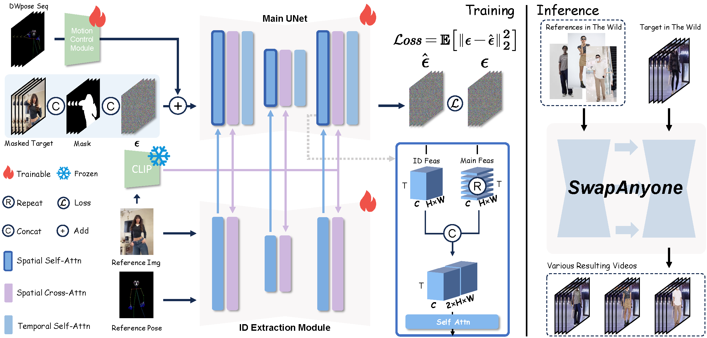

<h2 align="center"> 
  <a href="https://github.com/PKU-YuanGroup/SwapAnyone"> SwapAnyone: Consistent and Realistic Video Synthesis for Swapping Any Person into Any Video</a>
</h2>
<h5 align="center"> 
If you like our project, please give us a star ⭐ on GitHub for latest update.  </h5>
<h5 align="center">

<!-- [](https://arxiv.org/) -->
<!--
[](https://github.com/PKU-YuanGroup/NeuralGS/blob/main/LICENSE) 
[](https://github.com/PKU-YuanGroup/NeuralGS/stargazers)&#160;
[](https://github.com/PKU-YuanGroup/NeuralGS/network)&#160;
[](https://github.com/PKU-YuanGroup/NeuralGS/watchers)&#160;
-->
</h5>

You can visit our [project page](https://github.com/PKU-YuanGroup/SwapAnyone) to get the video results. 

<h3>Results of SwapAnyone.


### Implemetation of __SwapAnyone: Consistent and Realistic Video Synthesis for Swapping Any Person into Any Video__




## 🗓️ TODO
We will update the following list after the paper is accepted.
- [x] [2025-03-13] We have released our [project page](https://github.com/PKU-YuanGroup/SwapAnyone).
- [x] We have uploaded our paper, SwapAnyone on [arXiv](https://arxiv.org/abs/2503.09154)
- [ ] Upload the code
- [ ] Open-source training
- [ ] Open-source datasets

## 🌅 Comparisons with others.


## 📊 Quantitative comparison


## 📊 Human evaluation test statistics


## 🤝 Contributors

<a href="https://github.com/PKU-YuanGroup/SwapAnyone/graphs/contributors">
  
</a>


## 🙏 Acknowledgements


## BibTeX

```
@misc{SwapAnyone,
        title={SwapAnyone: Consistent and Realistic Video Synthesis for Swapping Any Person into Any Video}, 
        author={Chengshu Zhao and Yunyang Ge and Xinhua Cheng and Bin Zhu and Yatian Pang and Bin Lin and Fan Yang and Feng Gao and Li Yuan},
        year={2025},
        eprint={2503.09154},
        archivePrefix={arXiv},
        primaryClass={cs.CV},
        url={https://arxiv.org/abs/2503.09154}, 
    }
```
